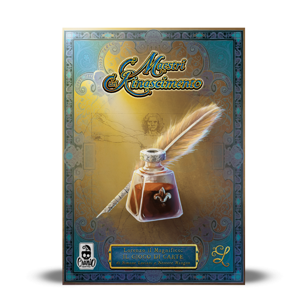

# Software Engineering final project

Maestri del Rinascimento is the final project of **Software Engineering** course held
at Politecnico di Milano. (2020/2021)  

**Teacher** Pierluigi San Pietro



## Implemented Functionalities
| Functionality | Status |
|:-----------------------|:------------------------------------:|
| Basic rules | [✅](https://github.com/fraleone99/ing-sw-2021-Iovine-Landini-Leone/tree/main/src/main/java/it/polimi/ingsw/model) |
| Complete rules | [✅](https://github.com/fraleone99/ing-sw-2021-Iovine-Landini-Leone/tree/main/src/main/java/it/polimi/ingsw/model) |
| Socket |[✅](https://github.com/fraleone99/ing-sw-2021-Iovine-Landini-Leone/tree/main/src/main/java/it/polimi/ingsw/server) |
| GUI | [✅](https://github.com/fraleone99/ing-sw-2021-Iovine-Landini-Leone/tree/main/src/main/java/it/polimi/ingsw/client/view/GUI) |
| CLI |[✅](https://github.com/fraleone99/ing-sw-2021-Iovine-Landini-Leone/tree/main/src/main/java/it/polimi/ingsw/client/view/CLI) |
| Multiple games | [✅](https://github.com/fraleone99/ing-sw-2021-Iovine-Landini-Leone/tree/main/src/main/java/it/polimi/ingsw/server)|
| Local single player | [✅](https://github.com/fraleone99/ing-sw-2021-Iovine-Landini-Leone/blob/main/src/main/java/it/polimi/ingsw/controller/LocalSPController.java) |
| Resilience | [✅](https://github.com/fraleone99/ing-sw-2021-Iovine-Landini-Leone/tree/main/src/main/java/it/polimi/ingsw/server) |
| Persistence | [⛔]() |
| Editor | [⛔]() |

#### Legend
[⛔]() Not Implemented &nbsp;&nbsp;&nbsp;&nbsp; [⚠️]() Implementing&nbsp;&nbsp;&nbsp;&nbsp; [✅]() Implemented

## Running
To launch the game use the following command in the directory of the jar.

```
java -jar PSP07.jar 
```
You'll have to choose if you want to run the server, CLI client or GUI client.

If you want to do a local game, you won't need to start a server.

If you want to do a multiplayer game, you'll need to start a server and at least two client.

You can also do a single player game connected to the server.

If you use the default configuration on the server the port is 3456.

The recommended setting for the GUI on Windows are : 
* Resolution 1920x1080 
* Scale and layout: 125%

## Authors
* [Lorenzo Iovine](https://github.com/lorenzoiovine99)
* [Nicola Landini](https://github.com/neekoo0)
* [Francesco Leone](https://github.com/fraleone99)

# Tools
* Astah UML - UML Diagrams
* Maven - Dependency Management
* Intellij - IDE
* JavaFX - GUI

## License
This project is developed in collaboration with [Politecnico di Milano](https://www.polimi.it/) and [Cranio Creations](https://www.craniocreations.it/)


